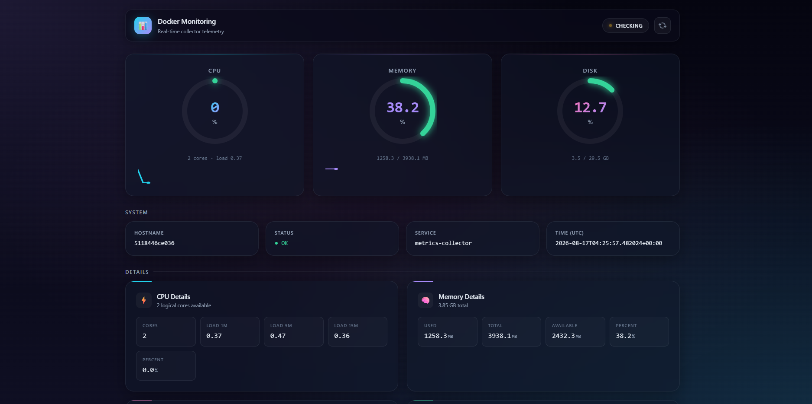
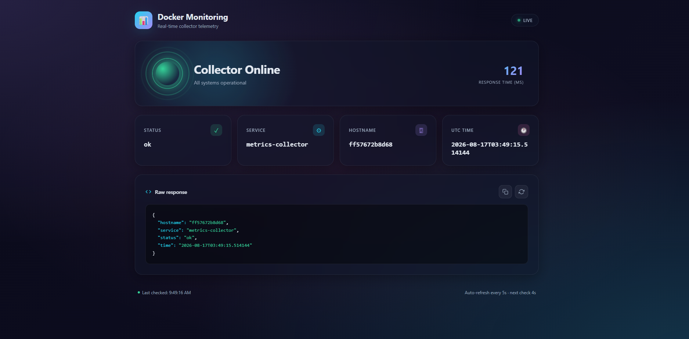
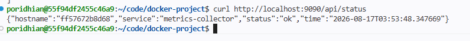
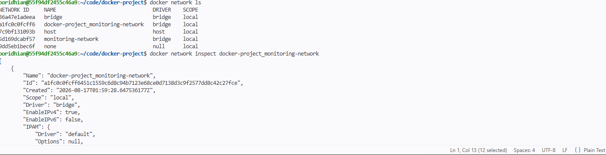

# Containerized Linux System Monitoring Platform

A two-container Docker application that collects live system metrics (CPU, RAM, disk, network) via a Flask API and displays them on a real-time web dashboard served by NGINX.

---

## Architecture

```
Linux Server
      │
  ┌───┼───────────┐
  ↓   ↓           ↓
 CPU  RAM        Disk
  │   │           │
  └───┼───────────┘
      ↓
 Metrics Collector
     Flask :6000
      │
  /api/metrics
      ↓
    NGINX
      ↓
 Web Dashboard :9090
      │
 ┌────┼────────┐
 ↓    ↓        ↓
CPU  RAM      Disk
32%  61%      45%
```

Both containers share a custom bridge network (`monitoring-network`) so the dashboard can reach the collector by its service name. A named volume (`metrics-data`) is mounted into the collector for persistent storage.

---

## Services

| Service | Image source | Internal port | Host port |
|---|---|---|---|
| `collector` | `./collector` | 6000 | — (internal only) |
| `dashboard` | `./dashboard` | 80 | **9090** |

### Collector (`collector/`)

- Built on `python:3.12-slim`
- Uses **Flask** + **psutil** to expose three endpoints:

| Endpoint | Description |
|---|---|
| `GET /` | API info |
| `GET /metrics` | Raw metrics JSON |
| `GET /status` | Service status + metrics |

Metrics collected: CPU %, CPU count, load averages, memory usage, disk usage, network I/O, uptime.

### Dashboard (`dashboard/`)

- Built on `nginx:latest`
- Serves a single-page HTML dashboard that polls `/api/metrics` every few seconds
- NGINX proxies `/api/` requests upstream to `http://collector:6000/`
- CORS headers and cache-busting headers are set for all responses

---

## Project Structure

```
.
├── compose.yaml
├── collector/
│   ├── app.py            # Flask metrics API
│   ├── Dockerfile
│   └── requirements.txt  # Flask 3.1.0, psutil 6.1.1
└── dashboard/
    ├── index.html        # Single-page dashboard UI
    ├── nginx.conf        # Reverse proxy + CORS config
    └── Dockerfile
```

---

## Getting Started

### Prerequisites

- [Docker](https://docs.docker.com/get-docker/) with the Compose plugin (v2+)

### Run

```bash
docker compose up -d --build
```

Then open **http://localhost:9090** in your browser.

### Stop

```bash
docker compose down
```

To also remove the named volume:

```bash
docker compose down -v
```

---

## Screenshots

### Dashboard





### Metrics API — `/status` endpoint



### Docker containers running


### Docker images


### Docker network


### Docker volume


### Network diagram



---

## Key Concepts

**Docker image vs container**
An image is a read-only template bundling the app, libraries, and config. A container is the running instance of that image with a writable layer on top. Data written inside the container is lost when it is removed unless backed by a volume.

**Port mapping `9090:80`**
Port 9090 on the host forwards to port 80 inside the dashboard container. Accessing `localhost:9090` in a browser sends the request through Docker to NGINX.

**Docker networks**
The custom bridge network lets containers address each other by service name. The dashboard reaches the collector at `http://collector:6000` without exposing that port to the host.

**Docker volumes**
The `metrics-data` volume is mounted at `/data` in the collector container. Data stored there survives container restarts and recreation.

**Docker Compose**
Compose defines all services, networks, volumes, ports, and dependencies in one `compose.yaml` file. A single `docker compose up -d` builds and starts everything; `docker compose down` tears it all down cleanly.

**Restart policy**
Both services use `restart: unless-stopped`. Docker automatically restarts the container if it crashes or if the Docker daemon restarts, but leaves it stopped if it was manually stopped.
# Docker-Monitoring-Dashboard
